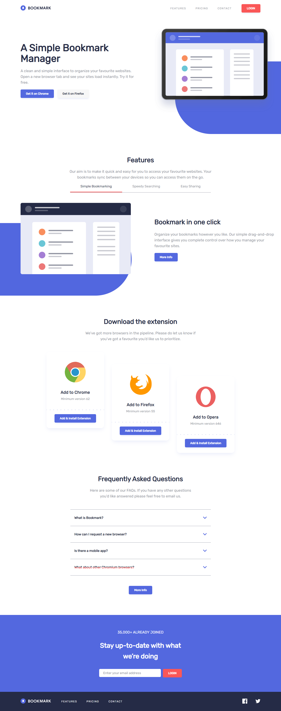

# Frontend Mentor - Bookmark landing page solution

This is a solution to the [Bookmark landing page challenge on Frontend Mentor](https://www.frontendmentor.io/challenges/bookmark-landing-page-5d0b588a9edda32581d29158). Frontend Mentor challenges help you improve your coding skills by building realistic projects.

## Table of contents

- [Frontend Mentor - Bookmark landing page solution](#frontend-mentor---bookmark-landing-page-solution)
  - [Table of contents](#table-of-contents)
  - [Overview](#overview)
    - [The challenge](#the-challenge)
    - [Screenshot](#screenshot)
    - [Links](#links)
  - [My process](#my-process)
    - [Built with](#built-with)
    - [What I learned](#what-i-learned)
    - [Useful resources](#useful-resources)
  - [Author](#author)

**Note: Delete this note and update the table of contents based on what sections you keep.**

## Overview

### The challenge

Users should be able to:

- View the optimal layout for the site depending on their device's screen size
- See hover states for all interactive elements on the page
- Receive an error message when the newsletter form is submitted if:
  - The input field is empty
  - The email address is not formatted correctly

### Screenshot

### Links

- Solution URL: [Github repo](https://github.com/iadefidipe/bookmark-landing-page)
- Live Site URL: [Netlify host](https://bookmark-extension-page.netlify.app/)

## My process

### Built with

- Semantic HTML5 markup
- CSS custom properties
- Flexbox
- CSS Grid
- Mobile-first workflow
- [React](https://reactjs.org/) - JS library
- [Styled Components](https://styled-components.com/) - For styles
- React router

### What I learned

- I learnt the basic of react, passing props between components, making reusable components, state managment and react routing.
- Learnt how to use styled components for styling in react projects
- Learnt about theme context and global styles

### Useful resources

- [Traversy Styled component crash course](https://youtu.be/02zO0hZmwnw) - This helped me get started with styled components. I like how the subject was simplified in the video and easy to follow

## Author

- Website - [Add your name here](https://www.your-site.com)
- Frontend Mentor - [@iadefidipe](https://www.frontendmentor.io/profile/iadefidipe)
- Twitter - [@iadefidipe](https://www.twitter.com/iadefidipe)
